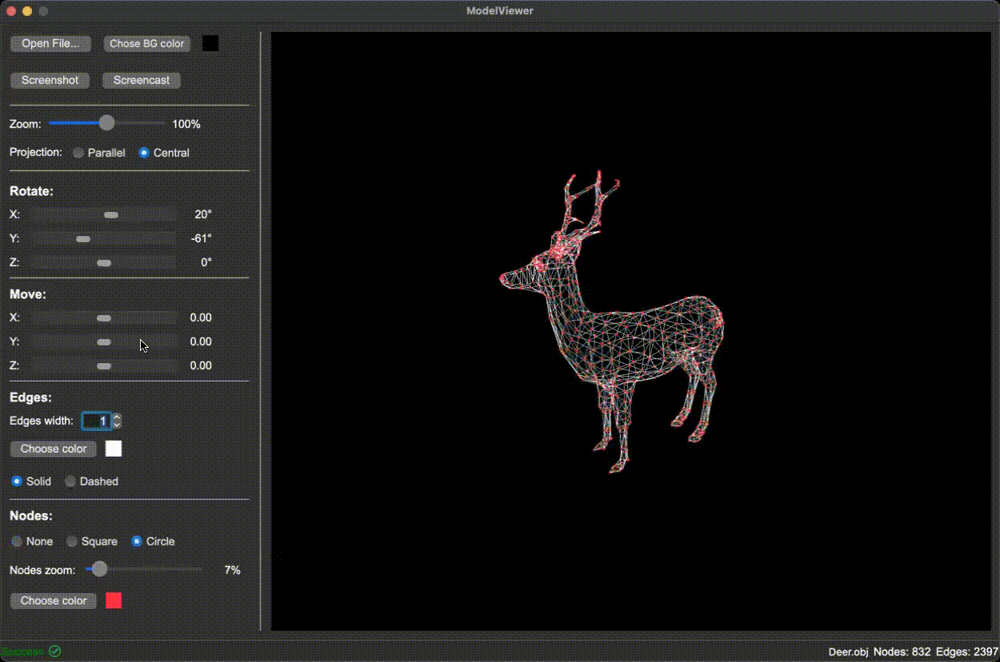

# 3DViewer v1.0

1. [Introduction](#introduction)
2. [Install](#install)
3. [Testing](#testing)

## Introduction

In this project I have implemented a program for viewing three-dimensional wireframe models (3D Viewer) in the programming language C/C++ with Qt. The models are loaded from .obj files and viewed on the screen with the ability to rotate, scale and translate.
The program is built with a Makefile(and cmake for Qt) which contains a set of goals: all, install, uninstall, clean, dvi, dist, tests, gcov.
Examples of obj-files are stored in obj_examples

The graphical user interface contains:

- A button for selecting a model file and a field for displaying its name.
- Visualization area for the wireframe model.
- Slider and input fields for translating the model.
- Slider and input fields for model rotation.
- Slider and entry fields for model scaling.
- Information about the loaded model - file name, number of vertices and edges in the status bar.
- The program allows setting the projection type (parallel and central).
- The program allows you to adjust the type (solid, dashed), color and thickness of edges, display method (none, circle, square), color and size of vertices.
- The program allows you to select the background color
- The settings are saved between program restarts
- Program allows you to save captured (rendered) images as bmp and jpeg files.
- Program allows you to record small screencasts by special button - current user affine transformation of captured object into gif-animation (640x480, 10fps, 5s)

## Install

Installation is done with a Makefile from src folder using the **make install** command. The application is built in the folder __install_dir__

## Testing

For tests, use the make test and make gcov_report command to find out the coverage of the functional part.
